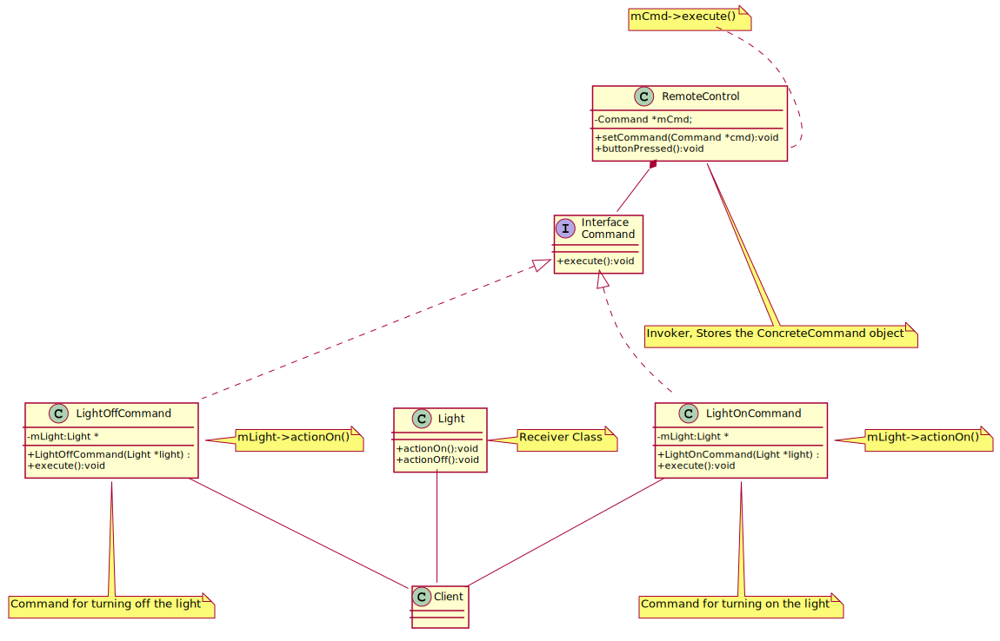

# Behavioral Patterns
- [Chain Of Responsibility](#chain-of-responsibility)
- [Command](#command)
- [Interpreter](#interpreter)
- [Iterator](#iterator)
- [Mediator](#mediator)
- [Memento](#memento)
- [NullObject](#nullobject)
- [Observer](#observer)
- [State](#state)
- [Strategy](#strategy)
- [Template Method](#template-method)
- [Visitor](#visitor)
## Chain Of Responsibility
There is a potentially variable number of "handler" or "processing element" or "node" objects, and a stream of requests that must be handled. Need to efficiently process the requests without hard-wiring handler relationships and precedence, or request-to-handler mappings.

The chain-of-responsibility pattern is structurally nearly identical to the decorator pattern, the difference being that for the decorator, all classes handle the request, while for the chain of responsibility, exactly one of the classes in the chain handles the request. This is a strict definition of the Responsibility concept in the GoF book. However, many implementations (such as loggers below, or UI event handling, or servlet filters in Java, etc) allow several elements in the chain to take responsibility.

[plantuml code](diagrams/chain_of_responsibility.puml)

Chain of Responsibility, Command, Mediator, and Observer, address how you can decouple senders and receivers, but with different trade-offs. Chain of Responsibility passes a sender request along a chain of potential receivers.
Chain of Responsibility can use Command to represent requests as objects.
Chain of Responsibility is often applied in conjunction with Composite. There, a component's parent can act as its successor.

## Command
Command is a behavioral design pattern that turns a request into a stand-alone object that contains all information about the request. This transformation lets you parameterize methods with different requests, delay or queue a request’s execution, and support undoable operations.

The Invoker object calls execute() on a Command1 object. Command1 calls action1() on a Receiver1 object, which performs the request.

[plantuml code](diagrams/command.puml)

## Interpreter
## Iterator
Iterator is a behavioral design pattern that lets you traverse elements of a collection without exposing its underlying representation (list, stack, tree, etc.).
## Mediator
As to overcome the limitation of the Observer Design Pattern which works in a one-to-many relationship, Mediator Design Pattern can be employed for a many-to-many relationship.
## Memento
## NullObject
## Observer
Defines a a one to many dependency between objects so that when one object state changes, 
all of its dependencies are noified and updated automatically
## State
## Strategy
## Template Method
## Visitor
