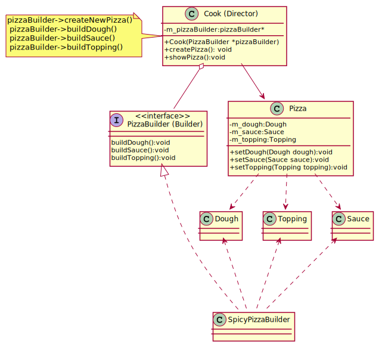
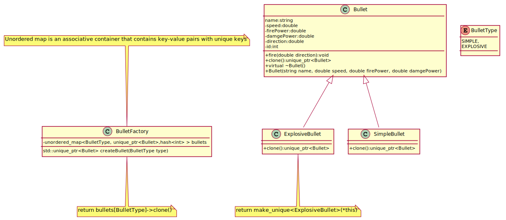

# Creational Patterns
- [Factory Method](#factory-method)
- [AbstractFactory](#abstractfactory)
- [Builder](#builder)
- [Prototype](#prototype)
- [Singleton](#singleton)
## Factory Method

Imagine programming a video game, where you would like to add new types of enemies in the future, each of which has different AI functions 
and can update differently. By using a factory method, the controller of the program can call to the factory to create the enemies, 
without any dependency or knowledge of the actual types of enemies.
 Now, future developers can create new enemies, with new AI controls and new drawing member functions, add it to the factory, and create a 
level which calls the factory, asking for the enemies by name. Combine this method with an XML description of levels, and developers could
 create new levels without having to recompile their program. All this, thanks to the separation of creation of objects from the usage of objects.
Factory Method defines an interface for creating an object, but let subclasses decide which class to instantiate. 

[plantuml code](diagrams/computer_factory_method.puml)

People often use Factory Method as the standard way to create objects. but it isn't necessary if: 
1) The class that's instantiated never changes.
2) Instantiation takes place in an operation that subclasses can easily override (such as an initialization operation).

**Factory Method** is similar to **Abstract Factory** but without the emphasis on families.
Factory Methods are routinely specified by an architectural framework, and then implemented by the user of the framework.

**Abstract Factory** classes are often implemented with **Factory Methods**, but they can be implemented using **Prototype** (class manufactures a new object or recycles an old one).
**Factory Methods** are usually called within **Template Methods**.
**Factory Method**: creation through inheritance. Factory Method requires subclassing, but doesn't require Initialize.
**Prototype**: creation through delegation. Prototype doesn't require subclassing, but it does require an Initialize operation.

## AbstractFactory
Supporting new kinds of products is difficult. Extending abstract factories to
produce new kinds of Products isn't easy. That's because the AbstractFactory
interface fixes the set of products that can be created. Supporting new kinds of
products requires extending the factory interface, which involves changing the
AbstractFactory class and all of its subclasses. We discuss one solution to this
problem in the Implementation section.

AbstractFactory classes are often implemented with factory methods (Factory Method
(107)), but they can also be implemented using Prototype (117).
95A concrete factory is often a singleton (Singleton (127)).

[plantuml code](diagrams/abstract_factory.puml)

**Abstract Factory** has the factory object producing objects of several classes. 
**Builder** has the factory object building a complex product incrementally using a correspondingly complex protocol. 
**Prototype** has the factory object (aka prototype) building a product by copying a prototype object.
Abstract Factory can be used as an alternative to **Facade** to hide platform-specific classes.
Abstract Factory classes are often implemented with **Factory Methods**, but they can also be implemented using Prototype.

Abstract Factory classes are often implemented with Factory Methods, but they can also be implemented using Prototype.
Abstract Factory can be used as an alternative to Facade to hide platform-specific classes.

## Builder
Builder is a creational design pattern that lets you construct complex objects step by step. An application needs to create the elements of a complex aggregate. The Builder Creational Pattern is used to separate the construction of a complex.

Imagine a complex object that requires laborious, step-by-step initialization of many fields and nested objects. Such initialization code is usually buried inside a monstrous constructor with lots of parameters. 
In most cases most of the parameters will be unused, making the constructor calls pretty ugly.
The Builder pattern suggests that you extract the object construction code out of its own class and move it to separate objects called builders.
Builder provides control over steps of construction process.

[plantuml code](diagrams/pizza_builder.puml)

**Abstract Factory**  is similar to Builder in that it too may construct complex objects.
The primary difference is that the Builder pattern focuses on constructing a complex
object step by step. Abstract Factory's emphasis is on families of product objects (either
simple or complex). Builder returns the product as a final step, but as far as the Abstract
Factory pattern is concerned, the product gets returned immediately.

creat complex object and there is a dependency between them and you want to creat it step by step
step by step is the requiremenet and there is a depenedncy between those objects

You can construct objects step-by-step, defer construction steps or run steps recursively.
 You can reuse the same construction code when building various representations of products.
 Single Responsibility Principle. You can isolate complex construction code from the business logic of the product.

Many designs start by using Factory Method (less complicated and more customizable via subclasses) and evolve toward Abstract Factory, Prototype, or Builder (more flexible, but more complicated).

Builder focuses on constructing complex objects step by step. Abstract Factory specializes in creating families of related objects. Abstract Factory returns the product immediately, whereas Builder lets you run some additional construction steps before fetching the product.

You can use Builder when creating complex Composite trees because you can program its construction steps to work recursively.

You can combine Builder with Bridge: the director class plays the role of the abstraction, while different builders act as implementations.

Abstract Factories, Builders and Prototypes can all be implemented as Singletons.

## Prototype
Prototype is a creational design pattern that lets you copy existing objects without making your code dependent on their classes.
If you want to copy object into an other one, you have to create a new object of the same class and then you have to go through 
all the fields of the original object and copy their values over to the new object but not all objects can be copied that way because some of the object’s fields may be private and not visible from outside of the object itself.

[plantuml code](diagrams/bullet_prototype.puml)

There are cases when either **Prototype** or **Abstract Factory** could be used properly. At other times they are complementary:
 Abstract Factory might store a set of Prototypes from which to clone and return product objects. **Abstract Factory**, **Builder**, and **Prototype** can use **Singleton** in their implementations.

Abstract Factory classes are often implemented with Factory Methods, but they can be implemented using **Prototype**.
Factory Method: creation through inheritance. Prototype: creation through delegation.
Often, designs start out using Factory Method (less complicated, more customizable, subclasses proliferate) and evolve toward Abstract Factory, Prototype, or Builder (more flexible, more complex) as the designer discovers where more flexibility is needed.
Prototype doesn't require subclassing, but it does require an "initialize" operation. Factory Method requires subclassing, but doesn't require Initialize.
Designs that make heavy use of the Composite and Decorator patterns often can benefit from Prototype as well.
Prototype co-opts one instance of a class for use as a breeder of all future instances.
Prototypes are useful when object initialization is expensive, and you anticipate few variations on the initialization parameters. In this context, Prototype can avoid expensive "creation from scratch", and support cheap cloning of a pre-initialized prototype.
Prototype is unique among the other creational patterns in that it doesn't require a class – only an object. Object-oriented languages like Self and Omega that do away with classes completely rely on prototypes for creating new objects.

## Singleton

Singleton is a creational design pattern that lets you ensure that a class has only one instance, while providing a global access point to this instance.

[plantuml code](diagrams/singleton.puml)

Abstract Factory, Builder, and Prototype can use Singleton in their implementation.
Facade objects are often Singletons because only one Facade object is required.
State objects are often Singletons.
The advantage of Singleton over global variables is that you are absolutely sure of the number of instances when you use Singleton, and, you can change your mind and manage any number of instances.
The Singleton design pattern is one of the most inappropriately used patterns. Singletons are intended to be used when a class must have exactly one instance, no more, no less. Designers frequently use Singletons in a misguided attempt to replace global variables. A Singleton is, for intents and purposes, a global variable. The Singleton does not do away with the global; it merely renames it.
When is Singleton unnecessary? Short answer: most of the time. Long answer: when it's simpler to pass an object resource as a reference to the objects that need it, rather than letting objects access the resource globally. The real problem with Singletons is that they give you such a good excuse not to think carefully about the appropriate visibility of an object. Finding the right balance of exposure and protection for an object is critical for maintaining flexibility.
Our group had a bad habit of using global data, so I did a study group on Singleton. The next thing I know Singletons appeared everywhere and none of the problems related to global data went away. The answer to the global data question is not, "Make it a Singleton." The answer is, "Why in the hell are you using global data?" Changing the name doesn't change the problem. In fact, it may make it worse because it gives you the opportunity to say, "Well I'm not doing that, I'm doing this" – even though this and that are the same thing.

Refs:
	[1](https://www.youtube.com/watch?v=KBkkEKNlE6I),
	[2](https://www.youtube.com/watch?v=D1CnNAszv_M&list=PLk6CEY9XxSIDZhQURp6d8Sgp-A0yKKDKV&index=6),
	[3](https://sourcemaking.com/),
	[4](https://refactoring.guru/)

