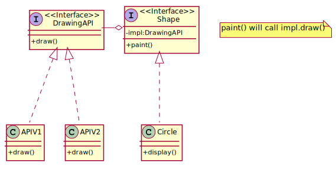
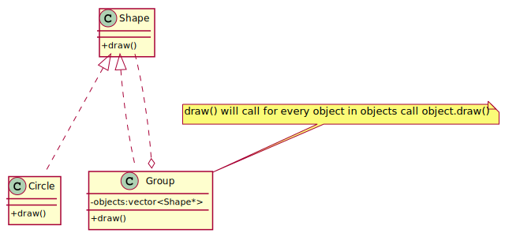
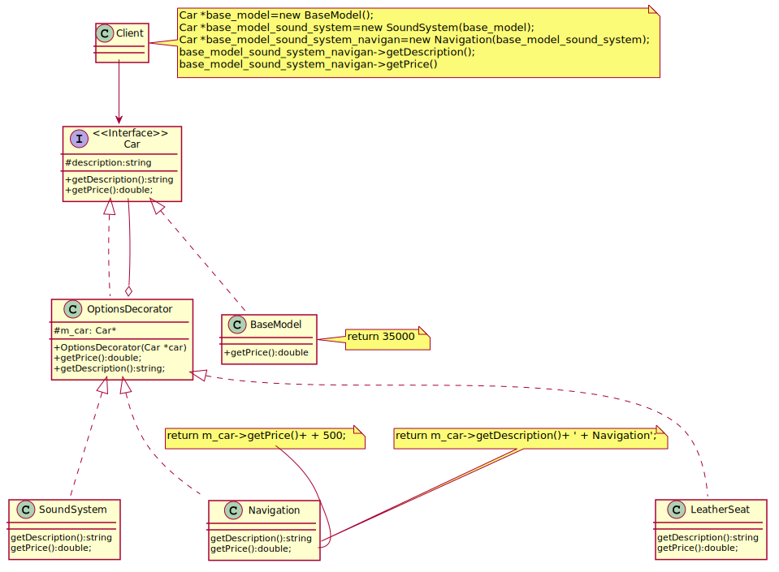

## Adapter

An "off the shelf" component offers compelling functionality that you would like to reuse, but its "view of the world" is not compatible with the philosophy and architecture of the system currently being developed.

Convert the interface of a class into another interface clients expect. Adapter lets classes work together that couldn't otherwise because of incompatible interfaces.
Wrap an existing class with a new interface.

[plantuml code](diagrams/adapter.puml)

**Adapter** makes things work after they're designed.
**Bridge** makes them work before they are.

**Adapter** provides a different interface to its subject. 
**Proxy** provides the same interface. Decorator provides an enhanced interface.

**Adapter** is meant to change the interface of an existing object. 
**Decorator** enhances another object without changing its interface. Decorator is thus more transparent to the application than an adapter is. 
As a consequence, Decorator supports recursive composition, which isn't possible with pure Adapters.

**Facade** defines a new interface, whereas **Adapter** reuses an old interface. Remember that Adapter makes two existing interfaces work together as opposed to defining an entirely new one.

## Bridge

The Bridge Pattern is used to separate out the interface from its implementation. Doing this gives the flexibility so that both can vary independently.

Decompose the component's interface and implementation into orthogonal class hierarchies. The interface class contains a pointer to the abstract implementation class. This pointer is initialized with an instance of a concrete implementation class, but all subsequent interaction from the interface class to the implementation class is limited to the abstraction maintained in the implementation base class. The client interacts with the interface class, and it in turn "delegates" all requests to the implementation class.

The interface object is the "handle" known and used by the client; while the implementation object, or "body", is safely encapsulated to ensure that it may continue to evolve, or be entirely replaced (or shared at run-time.

Use the Bridge pattern when:

you want run-time binding of the implementation,
you have a proliferation of classes resulting from a coupled interface and numerous implementations,
you want to share an implementation among multiple objects,
you need to map orthogonal class hierarchies.
Consequences include:

decoupling the object's interface,
improved extensibility (you can extend (i.e. subclass) the abstraction and implementation hierarchies independently),
hiding details from clients.
Bridge is a synonym for the "handle/body" idiom. This is a design mechanism that encapsulates an implementation class inside of an interface class. The former is the body, and the latter is the handle. The handle is viewed by the user as the actual class, but the work is done in the body. "The handle/body class idiom may be used to decompose a complex abstraction into smaller, more manageable classes. The idiom may reflect the sharing of a single resource by multiple classes that control access to it (e.g. reference counting)."

[plantuml code](diagrams/bridge.puml)

## Composite
Composite design pattern is to solve the problem representing "whole-part" hierarchical relationships. Compose objects into tree 
structures to represent whole-part hierarchies. Composite lets clients treat individual objects and compositions of objects uniformly. 

[plantuml code](diagrams/composite.puml)

**Composite** and **Decorator** have similar structure diagrams, reflecting the fact that both rely on recursive composition
 to organize an open-ended number of objects.

**Composite** can be traversed with **Iterator**. **Visitor** can apply an operation over a Composite. Composite could use **Chain of Responsibility** to let components access global properties through their parent. 
It could also use Decorator to override these properties on parts of the composition. It could use Observer to tie one object structure to 
another and State to let a component change its behavior as its state changes.
Composite can let you compose a **Mediator** out of smaller pieces through recursive composition.
Decorator is designed to let you add responsibilities to objects without subclassing. Composite's focus is not on embellishment but on representation.
These intents are distinct but complementary. Consequently, Composite and Decorator are often used in concert.

**Flyweight** is often combined with Composite to implement shared leaf nodes.

## Decorator
You want to add behavior or state to individual objects at run-time. Inheritance is not feasible because it is static and applies to an entire class
Decorator attach additional responsibilities to an object dynamically. Decorators provide a flexible alternative to subclassing for 
extending functionality.

[plantuml code](diagrams/decorator.puml)

##Facade
Developers often use the facade design pattern when a system is very complex or difficult to understand because the system has many interdependent classes or because its source code is unavailable. This pattern hides the complexities of the larger system and provides a simpler interface to the client. 

[plantuml code](diagrams/facade.puml)

Remember that **Adapter** makes two existing interfaces work together as opposed to defining an entirely new one.

**Flyweight** shows how to make lots of little objects, Facade shows how to make a single object represent an entire subsystem.

## Flyweight
The pattern for saving memory (basically) by sharing properties of objects. Imagine a huge number of similar objects which all have most of their properties the same. It is natural to move these properties out of these objects to some external data structure and provide each object with the link to that data structure.

Prototype Vs. Flyweight Design Patterns
In Prototype objects' creation go through cloning, it ease object's creation. By making a request for cloning we create new cloned object each time.

In Flyweight by making a request we try to reuse as much objects as possible by sharing them. New required object will be created if we don't find such one. It's being done for resource optimization.

While in Prototype we could clone even one object, Flyweight pattern makes sense to use when in the application we use big number of objects.

## Proxy
