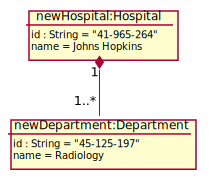
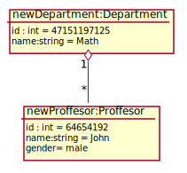

## Object Diagrams

An object diagram is a snapshot of the instances in a system and the relationship that exists between them at a point in time. 
Because it shows instances rather than classes, an object diagram is often called an instance diagram.
Since Object Diagrams use real world examples to illustrate the nature and structure of the system, it enables us to have a more tangible
 view of the relationships that exist between instances.

As a rule, you can characterize a structure exactly with a class diagram, yet sometimes the structure is as yet hard to 
comprehend. In these circumstances, two or three object diagram can have a significant effect.

You can tell that the elements in Figure 6.2 are instances because the names are underlined. Each
name takes the form instance name : class name.

[plantuml code](diagrams/Patient.puml)

### Composition

[plantuml code](diagrams/HospitalDepartment.puml)

### Aggregation

[plantuml code](diagrams/ProffesorDepartment.puml)

### Association

### Dependency

### Inheritance (Generalization)

